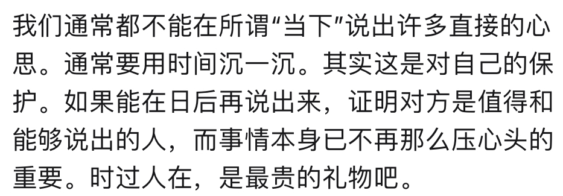

想要和你促膝长谈，当那些事情不再那么压在心头（引用）

诚实对我有莫大的魅力。我从小就是偏爱撒谎的小孩。一个够真的人让我觉得很新鲜，不会无聊。收到不喜欢的礼物时表明心意，做爱时不假装高潮，

我越来越为这些事而走神（伤神

我不知道这种迷茫是不是一个好兆头。一方面...，一方面它又像是无底洞，

非常不真诚，这两段，不要用

我们不约而同地固执着一定要到高档的酒店里做，为了攒钱，剪去形色的欲望，过清贫的生活，到了每个月的16号，我们就在奢华而宜人的酒店里抛掷一切，抛掷这个月的余额，也抛掷年轻的身体和数不尽的爱意。

会不会很突兀呢，说这些，我好希望你拆开这封信时是深夜，有一点点微醺，处在私密和静谧的空间，要是面前正好有一把空椅子就更好，你会想象我们促膝而谈，身体因为疲惫而瘫软，眼睛因为兴致勃勃而有神，---，正如我想象和渴望的那样。

>话题
+ 想学素描，诚实的艺术
+ 我对2024年有很多幻想，仿佛另一个高三暑假
  > 并且相比那时，我具有了更为自由的经济条件，更加丰沛的自我，更漫长的时间，我老是没来由地自信到觉得我可以成一些事，创作一些让自己满意的东西，在2024年。
+ 感到迷茫，重估一切价值
+ 我是一个嗜新鲜如命的人
  > 高中时候的痛苦来源于新鲜的经验太少，想得却过分多。